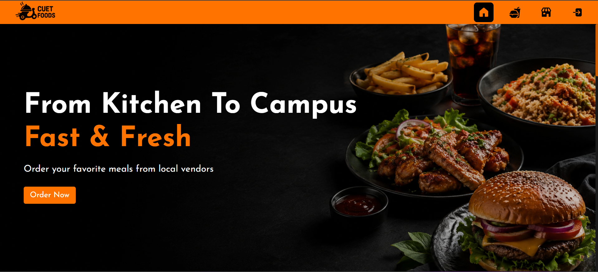
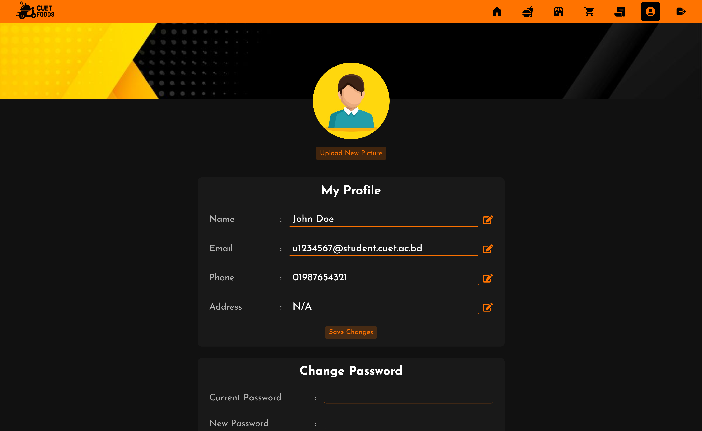
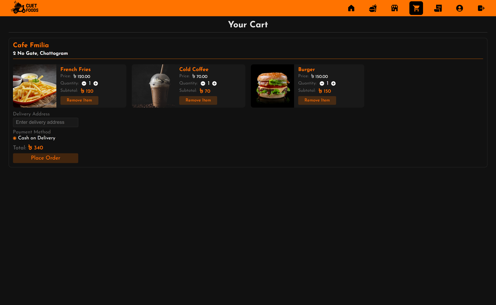
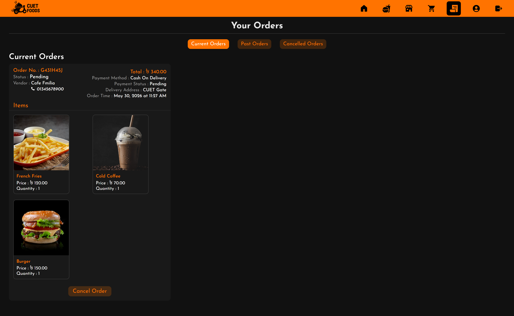
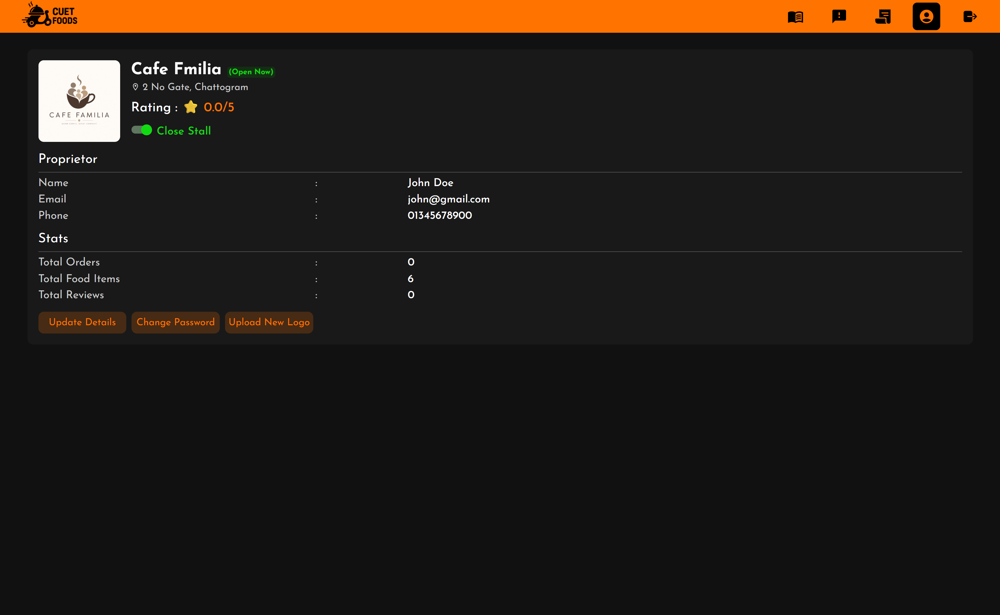
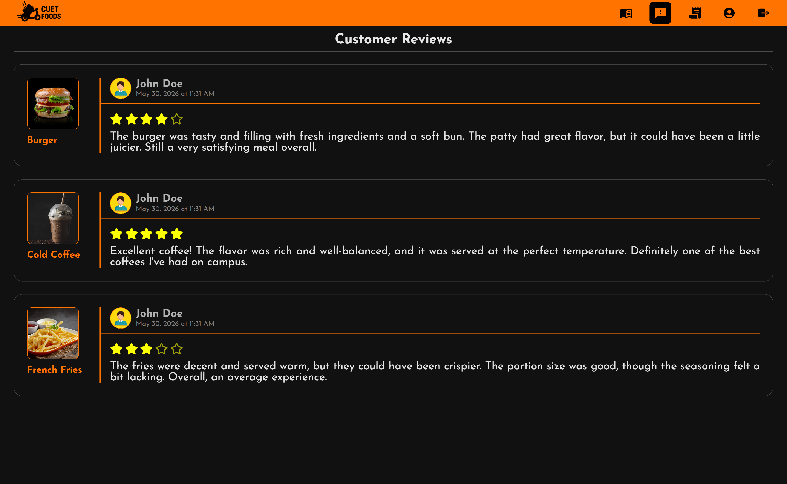

# CUET_Foods

A university campus food ordering platform built for CUET students.


## Live Demo

🌐 **Application URL:** https://cuet-foods.vercel.app

## Overview

`CUET_Foods` is a full-stack food ordering system designed for campus dining management. The project includes:

* A Node.js/Express backend API for authentication, food management, order processing, reviews, and user roles.
* A React frontend for students and vendors, built with Material UI and Sass for a responsive campus experience.
* A MySQL-backed database with automated table creation and secure user authentication.
* Cloud-based deployment using Vercel (Frontend), Railway (Backend & Database), and Cloudinary (Media Storage).

## Key Features

* Student and vendor authentication
* Food menu browsing and item management
* Order placement and live updates
* Review and rating support
* Public, student, vendor, and role-based route separation
* File uploads and media handling using Cloudinary and Multer
* Vendor stall status management (Open / Closed)

## Technology Stack

### Backend

* Node.js
* Express 5
* MySQL via `mysql2`
* JSON Web Tokens (`jsonwebtoken`)
* Password hashing with `bcryptjs`
* Environment variables with `dotenv`
* Cross-origin requests with `cors`
* File upload support with `multer`
* Cloudinary integration for media storage

### Frontend

* React 19
* React Router DOM 7
* Material UI (`@mui/material`)
* Sass (SCSS)
* Lottie animations with `lottie-react`
* React Icons

### Deployment

* Frontend: Vercel
* Backend: Railway
* Database: Railway MySQL
* Media Storage: Cloudinary

## Demo Account

For testing purposes, you may use the following student account:

**Email:** `u1234567@student.cuet.ac.bd`
**Password:** `john1234`

## Important Notes

### Student Registration

Student accounts must be registered using a valid CUET student email in the following format:

```text
uXXXXXXX@student.cuet.ac.bd
```

Example:

```text
u1234567@student.cuet.ac.bd
```

### Vendor Accounts

Vendor accounts are created separately and are intended for local food vendors/stall owners.

## Screenshots

### Home Page - Hero Section


### Student Dashboard


### Student Cart


### Orders


### Vendor Dashboard


### Vendor Menu Management


### Vendor Reviews


## Repository Structure

### Backend (`backend/`)

* `server.js` - Main backend entry point
* `src/config/` - Database and environment configuration
* `src/routes/` - API route definitions
* `src/controllers/` - Request handlers
* `src/models/` - Data models and mapping
* `src/queries/` - SQL query definitions
* `src/services/` - Business logic and helpers
* `src/utils/` - Utility functions and database initialization

### Frontend (`frontend/`)

* `src/App.js` - Application root and router setup
* `src/pages/` - Page components
* `src/components/` - Reusable UI components
* `src/context/` - Global state management

## Getting Started

### Backend

1. Open a terminal in `backend/`
2. Install dependencies:

```bash
npm install
```

3. Create a `.env` file:

```env
PORT=4000

DB_HOST=localhost
DB_USER=root
DB_PASSWORD=your_password
DB_NAME=cuet_foods

JWT_SECRET=your_secret_key

CLOUDINARY_CLOUD_NAME=your_cloud_name
CLOUDINARY_API_KEY=your_api_key
CLOUDINARY_API_SECRET=your_api_secret
```

4. Start the backend:

```bash
npm start
```

### Frontend

1. Open a terminal in `frontend/`
2. Install dependencies:

```bash
npm install
```

3. Create a `.env` file in the `frontend/` directory:

```env
REACT_APP_SERVER=your_backend_api_url
```

4. Start the application:

```bash
npm start
```

## Future Improvements

* Secure online payment integration
* Real-time order status updates
* Push notifications
* Email verification
* Advanced analytics for vendors
* Admin dashboard
* Mobile application for Android and iOS

## Project Origin

Originally developed as a hackathon project, CUET_Foods has evolved into a more complete academic and personal learning project focused on full-stack web development, system design, and real-world application architecture.

## License

This project is licensed under the MIT License.

You are free to use, modify, and distribute this project for learning and evaluation purposes, with proper attribution.
